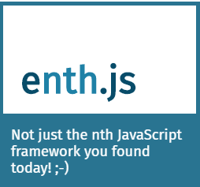

  

# Quick Intro

<a href="https://michael-klein.github.io/enthjs/">Click here to go to the documentation site, implemented with enth.js itself.</a>

enthjs is a JavaScript view library that the latest(-ish) language
features such as:

- web components for encapsulation
- generators to define components and templating directives
- tagged template literals for templating
- proxies for change tracking

The library is written in typescript and built as es6 modules. Most parts, including all templating directives, can be loaded on a as-needed basis.

